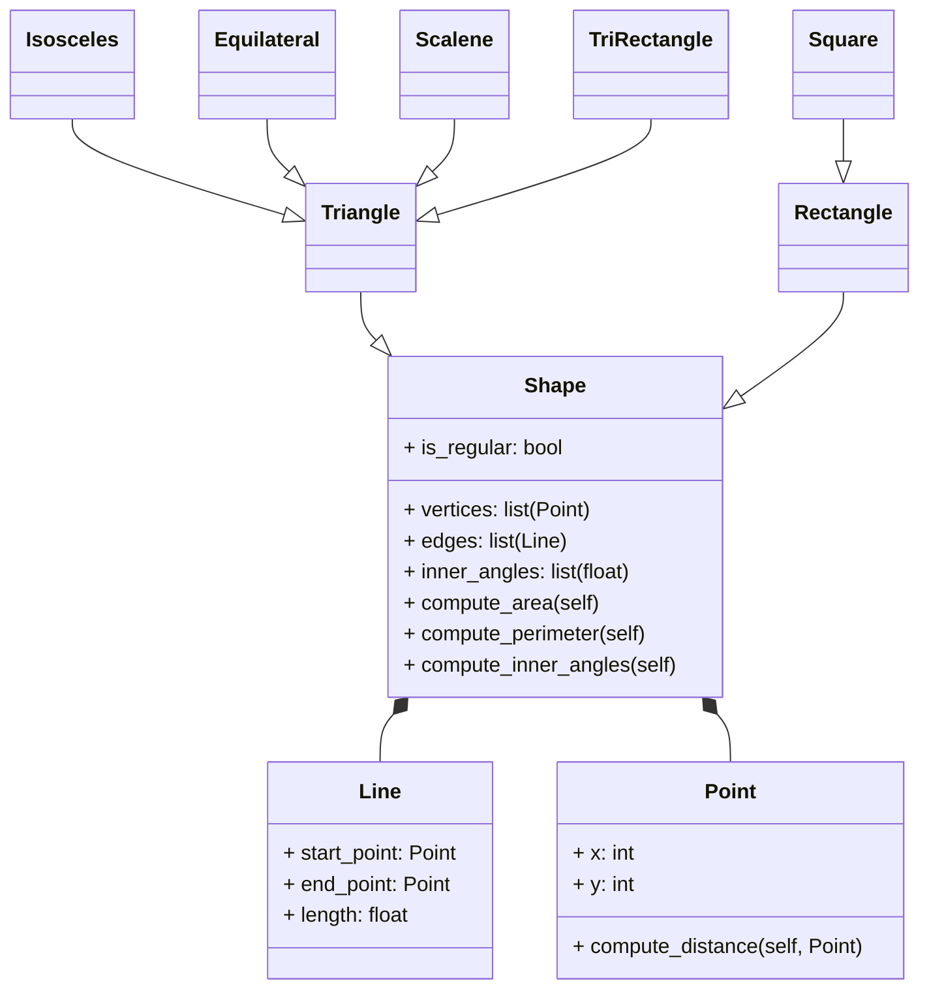

# Reto-4
----

**Ejercicio:**
1. Create a superclass called Shape(), which is the base of the classes Reactangle() and Square(), define the methods compute_area and compute_perimeter in Shape() and then using polymorphism redefine the methods properly in Rectangle and in Square.

2. Using the classes Point() and Line() define a new super-class Shape() with the following structure:

Use Inheritance, Composition, Encapsulation and Polymorphism to define the classes. All attributes must have their respective setters and getters.

## Reto 4: 
1. Include the class exercise in the repo.
2. **The restaurant revisted**
 - Add setters and getters to all subclasses for menu item
 - Override calculate_total_price() according to the order composition (e.g if the order includes a main course apply some disccount on beverages)
 - Add the class Payment() following the class example.
